# Growth Hacking_Youtube - User Action & Page Sequence

# \_Youtube

⇒ 구글이 서비스하는 글로벌 동영상 공유 플랫폼

- 전 세계 월간 실질 사용자 수는 20억명이고 100개 이상 국가에서 80개의 언어로 유튜브를 사용할 수 있다.
- 세계 2위 SNS(1위 페이스북), 세계 2위 검색엔진(1위 구글) \_글로벌 리서치기관 스태티스타.
- 2020년 9월 한국인 전 세대에서 가장 오래 이용한 앱이다. 3,377만명이 총 8억 8,500만 시간을 이용했다. \_앱 분석 서비스 와이즈앱.

### ► Business Model

1. 광고
2. 구독 (유튜브 프리미엄)
   - 유료 서비스 '유튜브 프리미엄' 사용 이유
     - 광고 없이 동영상을 즐기기 위해
     - Youtube TV, Music, Kids, Gaming 사용
     - 동영상 저장 후 오프라인 시청
     - 백그라운드 동영상 재생
     - 유튜브 오리지널 컨텐츠 이용

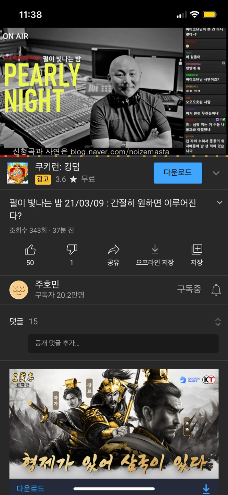

 

---

### ► 'User'의 정의

 
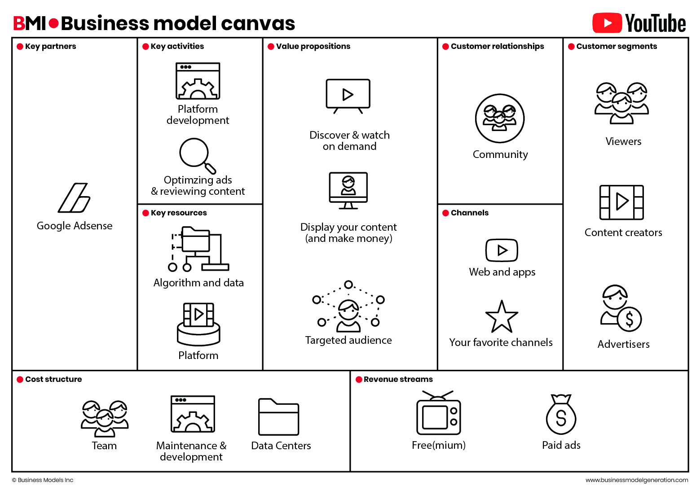
 

1. 유저 분류

- 컨텐츠 소비자
- 컨텐츠 생산자
- 광고주

2. 목적 💥

- 동영상 생산: 국내 광고수익 유튜브 채널은 9.7만개
- 동영상 소비: 유튜브 이용자는 3,377만명, (킬링 타임, 정보 습득, 기타(음악 플레이리스트 이용))

 

## 본문 전 피드백 먼저!

피드백을 먼저 배치한 이유는 본문이 아주 길고, 실제 목적과는 다르게 서술되어 있음을 알리기 위함입니다.

이번에 우리가 했던 분석은 UI 분석이었다...

 

 

그로스해킹을 하는 목적은 **분석을 통해서 서비스를 확장**하는 것이다. 그래서 우리는 UX가 어떻게 design되어 있는지를 우선 파악할 필요가 있는 것!!

 

### UX design이란?

UX란 "어떠한 제품, 시스템 또는 서비스에 대한 실제 사용이나 사용했을 때를 상상했을 때 그 사람이 느끼는 **해당 제품, 시스템 또는 서비스에 대한 인식이나 반응**"이다.

UX **design**이란 상품에 대한 **유저의 경험을 최대치로 만드는 것**이다. 사람들이 해당 사이트로 들어오고 싶게 만들고 들어왔을 때는 홈페이지에서 구매까지의 경험을 쉽고 재밌게 만드는 것이다.

 

그러므로 여기서 design이란 해당 제품이나 서비스에 관한 유저의 경험을 유용성, 편리성, 효과성 관점에서 어떻게 개선할 것인지에 관한 것이다.

유저의 경우 제품과 서비스를 혼용해서 사용하므로 UX는 유저가 해당 회사에 대해 장기적으로 어떤 이미지를 가지고, 어떻게 소통하느냐와 관련되는 일이라고 할 수 있다.

 

### 우리가 조사했어야 했던 부분

유저를 기준으로 해당 유저가 우리의 **비즈니스 모델에 맞춰 행동하도록 어떻게 UX가 디자인되어 있는지 확인**했어야 함.

예를들어 Youtube에서 유저란 컨텐츠 생산자, 컨텐츠 소비자, 광고주가 있는데 그 중 **한 유저를 선택**해서 **해당 유저가 yotube의 비즈니스 모델에 맞춰서 활동할 수 있도록 어떤 UX design**을 해놓았고 mobile의 경우 **어떤 클릭이나 스와이핑 활동**을 통해 **유저가 앱과 인터렉션**할 수 있는지 그 모든 활동들을 분석하고 그 숨은 의도를 파악하는 것이었다는 것이다!!!!!!! (이건 다음 시간에...)

 

---

 

## > Home

### 유튜브 인기 원인

1. 누구에게나 열려있다
2. 특별히 로그인 하지 않아도 이용 가능하다.
3. 댓글로 쌍방 간에 소통이 가능하고 비슷한 사람들의 이야기를 접할 수 있어 공감대를 형성한다.
4. 이용자 참여 유도하는 수익 구조

- 기존에는 동영상 콘텐츠가 방송사의 전유물이라면 지금은 개인도 동영상 콘텐츠를 만들 수 있다. → 수익 창출도 가능하다. (일정 조회 수 또는 구독자 수에 도달한 크리에이터에게 광고수익의 일부를 분배한다.)

### home 화면 사용자 행동

1. (스크롤 내려) 동영상을 클릭 한다.
2. 탐색
3. 동영상 업로드
4. 구독
5. 보관함

첫 화면 맨 위 광고 (3~4 번에 한번 정도로 광고 없음)

### shorts (현재 한국은 beta)

- 비교적 위에 있는 short (틱톡 유사 기능)
- 사용법은 틱톡 유저가 바로 적응할 수 있다.
- 기존 유튜브 영상처럼 광고가 적용되지는 않는다. 영상은 15초 정도로 아주 짧으므로 이 사이에 광고가 등장한다면 영상과 광고가 비슷한 길이가 될 가능성이 존재하기 때문이다.
- 틱톡의 강점인 제한 없는 음원 사용, 쉬운 모바일 영상 편집 툴 등은 완벽히 흡수했다.

#### shorts 클릭 했을 때

1. 좋아요/싫어요
2. 댓글
3. 공유
4. 더보기

- 왼쪽 → 오른쪽 스크롤
- 한 화면에 3개 볼 수 있다

#### 댓글

댓글을 인기순이나 최근 날짜 순으로 정렬 가능 하지만 별로도 정렬 하지 않을 경우의 알고리즘은

- 이전 : '좋아요'를 많이 받은 순으로 댓글이 우선적으로 표출됐다
- 현재 : 댓글 게시자의 구글플러스 계정과 연동한 평판을 기준으로 동영상과 가장 연관성이 높은 댓글이 먼저 노출된다.

끝없는 동영상 추천, 이전에 봤던 영상도 종종 보여줌

### 동영상 클릭 → 채널 클릭시 ( ex MBC drama)

### 유튜브 추천 알고리즘

출처 - [http://www.mediatoday.co.kr/news/articleView.html?idxno=204241](http://www.mediatoday.co.kr/news/articleView.html?idxno=204241)

‘유튜브 추천 알고리즘과 저널리즘’ - 한국언론진흥재단

유튜브에 들어가서 처음 보는 영상 목록, 영상 하나를 재생할 때 ‘다음 동영상’으로 표시되는 영상 목록 모두 알고리즘으로 추천된 콘텐츠다.
예를들면 ‘무한도전’을 보고 나면 이후에 계속해서 무한도전이 추천 영상으로 뜬다. 현재 재생 중인 영상과 비슷한 영상, 함께 재생된 적 많은 영상을 모두 올리며 유튜브 체류시간을 늘리는 전략이다.

하지만 유튜브 추천 알고리즘은 어떤 데이터를 중요하게 보는지, 언제 어떻게 바뀌었는지 외부에 공개 되지 않고 있다.

보고서는 카이스트·서울대 공학전문가들의 도움을 받아 △문재인 대통령 △방탄소년단 △유시민 △홍준표 △조국 등 5개 키워드를 대상으로 지난 9월2일부터 8일까지 일주일간 수집한 33만4425개의 추천 목록을 분석해 유튜브 추천 알고리즘의 경향을 파악했다. 그 결과 △전통적 언론사(특히 방송사)에 대한 선호 현상 △제목이 길거나 제목 안에 주요 키워드가 많을수록 선호하는 현상 △생중계 영상에 대한 선호 현상을 발견했다고 밝혔다.

- 유튜브 추천 알고리즘이 필터버블(확증편향) 등의 문제에 대한 (사회적인) 지적을 고려해 장르적 다양성을 의도하는 모습이 보였다.
- 특정 기간에 특정 이슈 영상을 집중적으로 추천하는 경향을 발견했고 시청시간이 추천 알고리즘의 중요한 요인으로 밝혀졌다. - 예컨대 음원 스트리밍 영상은 조회 수가 낮고 채널 구독자 수가 낮아도 끝까지 시청하는 경우가 많아 집중추천 되고 있었다.
- 개별 키워드의 이념적 성향에 따른 추천 결과에 있어서 유의미한 차이는 발견하지 못했다.
- 유튜브 이용자의 시청시간 중 70%가 추천된 영상을 본 시간으로 밝혀졌다.

## > Explore

### ► 목적

#### 1. 새로운 흥미 분야 발견 & 인기 급상승 영상 (Trending videos)

- 카테고리로 묶인 선택지를 통해서 **관련 카테고리에서 인기있는 영상을 쉽게 발견**

#### 2. 인기 급상승 Creator & Artist

- 컨텐츠의 다양성을 위해 매일 생기는 **새로운 크리에이터와 아티스트**들이 **팬을 찾을 수 있도록** 도와주는 기능
- 나라에 따라 다르게 서비스되고 있음

## ► 각 페이지 시퀀스

### T.O.P

 

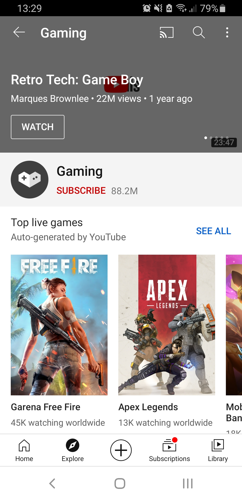
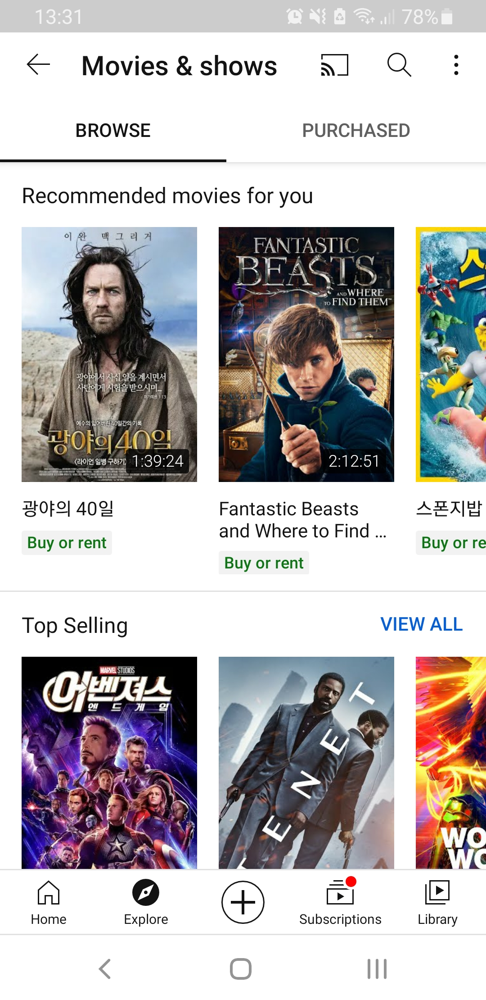
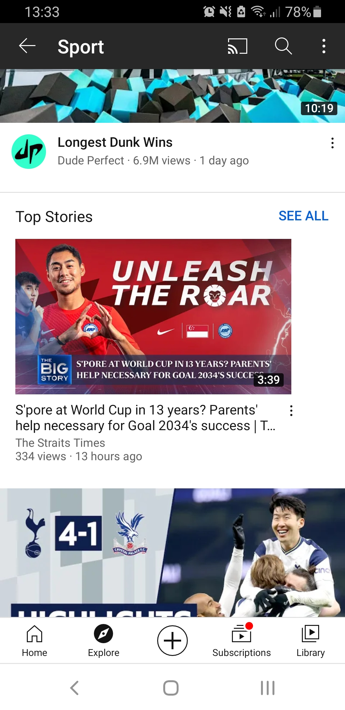
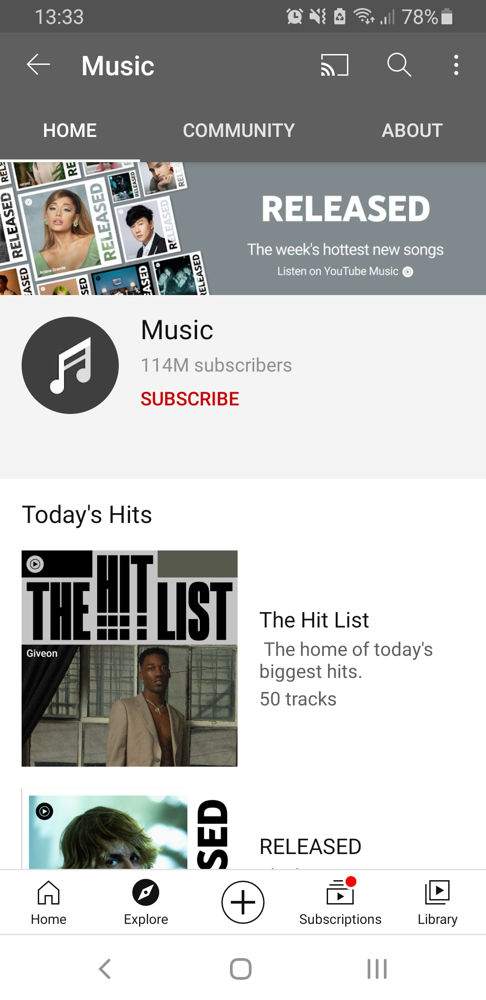

 

커피는 역시 T.O.P...가 아니라

 

메뉴 대부분이 공통적으로 **인기 영상** 위주로 **상단에 'top 무엇'으로 소개**를 해놓아서 사람들이 쉽게 영상을 선택해서 볼 수 있게 해줍니다.

 

---

 

### ► Live

Game/Sports/News와 같이 **동적인 메뉴**의 경우 **live 선택지**가 따로 있어서 현재 상영 중인 영상이 있다면 바로 시청할 수 있도록 도와줍니다.

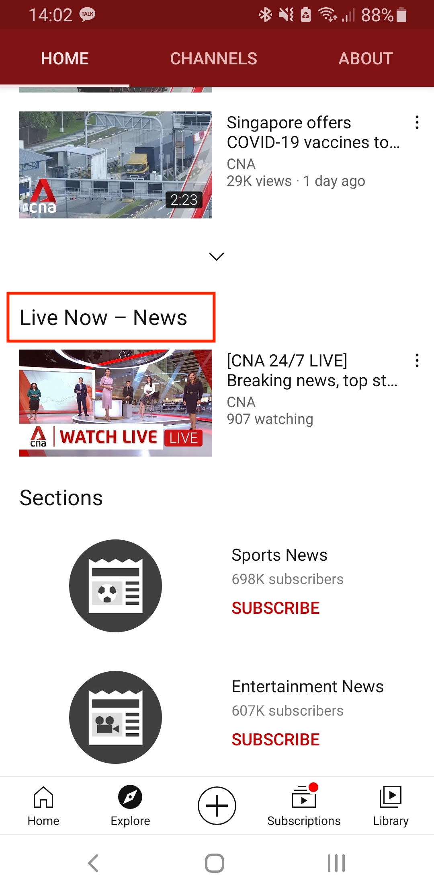
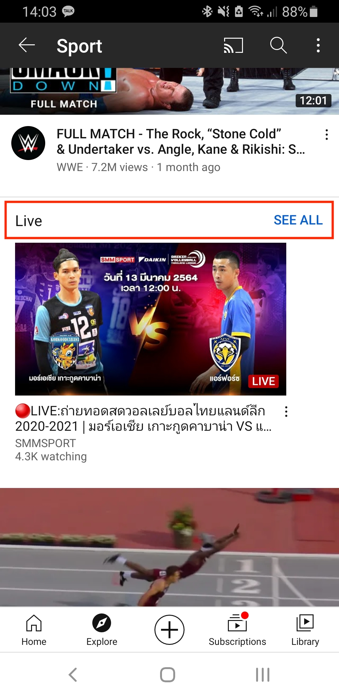

 

### ► 수익창출 관련 메뉴

- **films**과 **music**과 같이 수익 창출이 되는 탭의 경우 **끝없이 새로운 장르로 추천**을 해줌
- 셀렉션이 많은 fashion&beauty채널의 경우도 광고주들을 위한 메뉴라고 할 수 있음

 

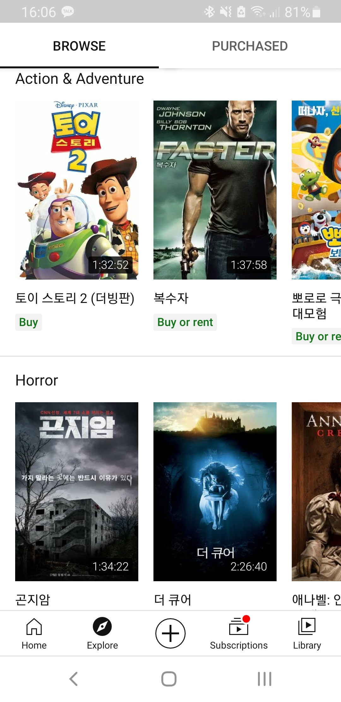

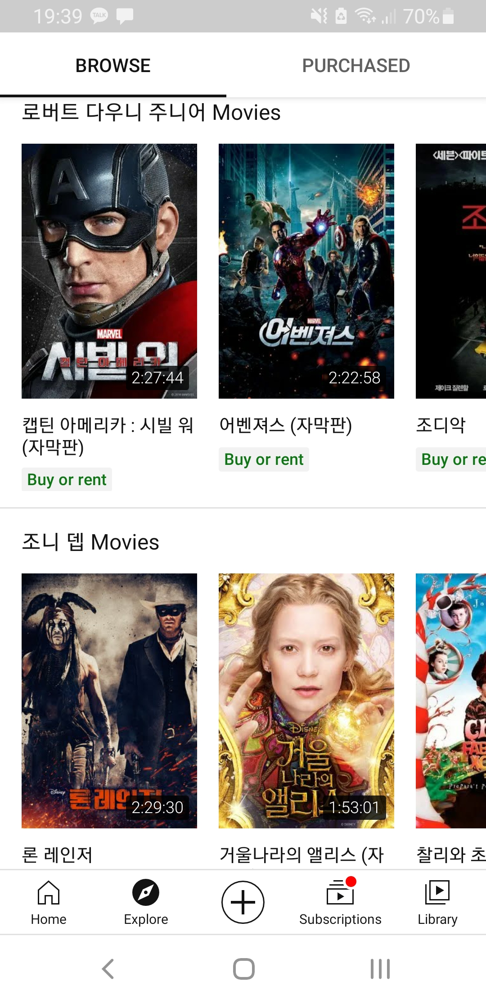

 

영화를 **장르 위주**로 추천해주다가 아래로 갈수록 **특정** 인기 많은 **만화** 또는 **시리즈**, **영화 배우 위주로 끝없이 추천**을 이어가서 어떻게든 소비자가 마음에 들 수 있는 선택권을 가질 수 있게 노력하는 모습

 

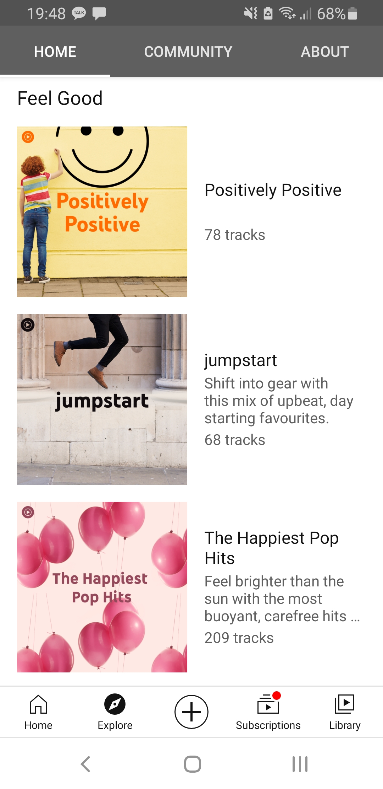
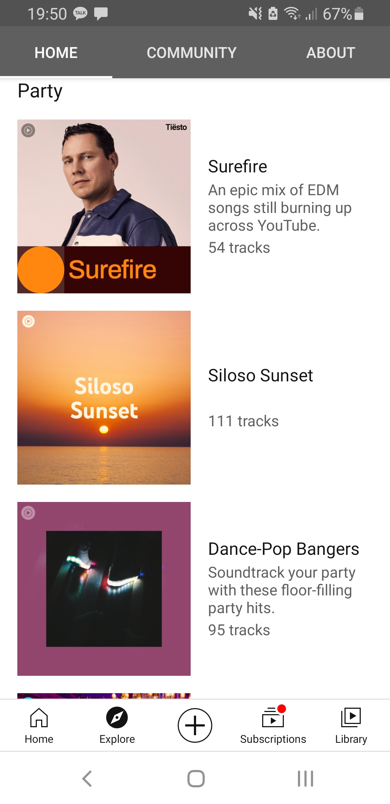
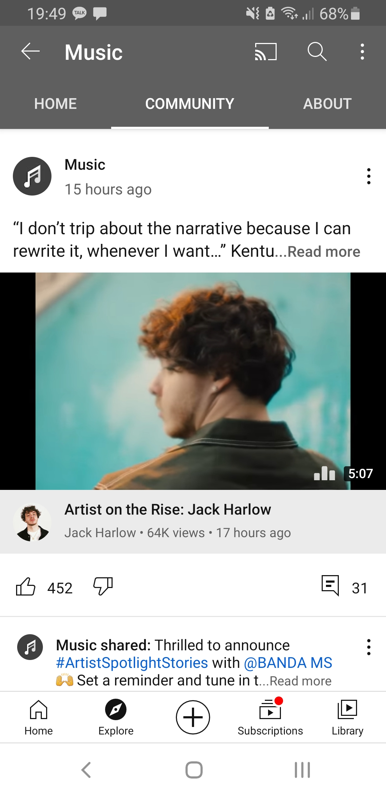

 

**음악의 경우** 장르로 분류할 경우 오히려 선택이 어렵고 담을 수 있는 컨텐츠들도 제한적이므로 **기분이나 상황에 따라 분류**하여 소비자가 **쉽게 새로운 음악도 접할 수 있도록** 해놓았고 **community라는 탭**을 첨부하여 **인스타그램처럼 아티스트들이 소통할 수 있는 창구**도 마련

community탭의 경우 아티스트들 즉, 컨텐츠 생산자이면서 동시에 광고주일수도 있는 사람을 대상으로 하는 서비스 같은 개념이 아닐까?

 

### ► Layout

 

 

 

# explore의 시퀀스 배치

상단 - 유저에게 원하는 주제를 선택할 수 있게 함.
explore의 메인 페이지에 이미 trending videos가 떠있음에도 불구하고 Trendingd이라는 선택권을 제일 먼저 배치함 -> 목적없이 그냥 새로운 것을 찾고 싶어하는 사람들을 위한 탭일까?

대부분의 메뉴에서는 제일 먼저 현재 가장 인기있는 컨텐츠들이 배치되어 있음

가로로 봤을 때 더 편하게 디자인되어 있다고 느낌

<!-- # revenue coming from where?

ads contribute roughly 10 percent to all Google revenue.

Youtube TV, Music, premium -> subscription business

## Youtube premium

- Ad-free
- download videos
- play in the background

## Youtube Music

- Ad-free
- download music
- play in the background

## Youtube Originals

- have access to all the Originals available

## Youtube Kids

## Youtube Gaming

뭐 특별한게 있는 건 아니고 광고없고 다운로드가능하고 백그라운드에서 상영되는건 똑같은데 유튭에서 생산되는 게임 관련 영상들을 볼 수 있는거라네
https://fourweekmba.com/how-does-youtube-make-money/#:~:text=YouTube%20Make%20Money%3F-,YouTube%20Business%20Model%20In%20A%20Nutshell,B%20in%20revenues%20in%202019. -->

---

 
 

## > Subscriptions

► 'User'는 누구인가?

: 전 연령대를 아우르는 동영상 소비자.

### ► 'User'가 동영상 소비를 위해 어떤 액션을 취하는가?

: 동영상을 탐색한다.

### ► '구독' 탭이 "왜" 존재하는가? 💥

: 유튜브에는 다양한 종류의 수많은 동영상이 있기 때문에 앱 체류 시간을 증가시킬 수 있다. 하지만 앱을 사용하는 동안 마주하게 되는 수많은 동영상과 광고로 인해 'User'의 피로감 역시 증가한다.

⇒ 개인이 구독하는 채널들의 동영상 리스트를 탐색하며 시청할 동영상을 선택할 수 있는 '구독'탭을 통해 'User'의 피로감을 감소시키고자 한다.

### ► User Flow (User Action & Page Sequence)

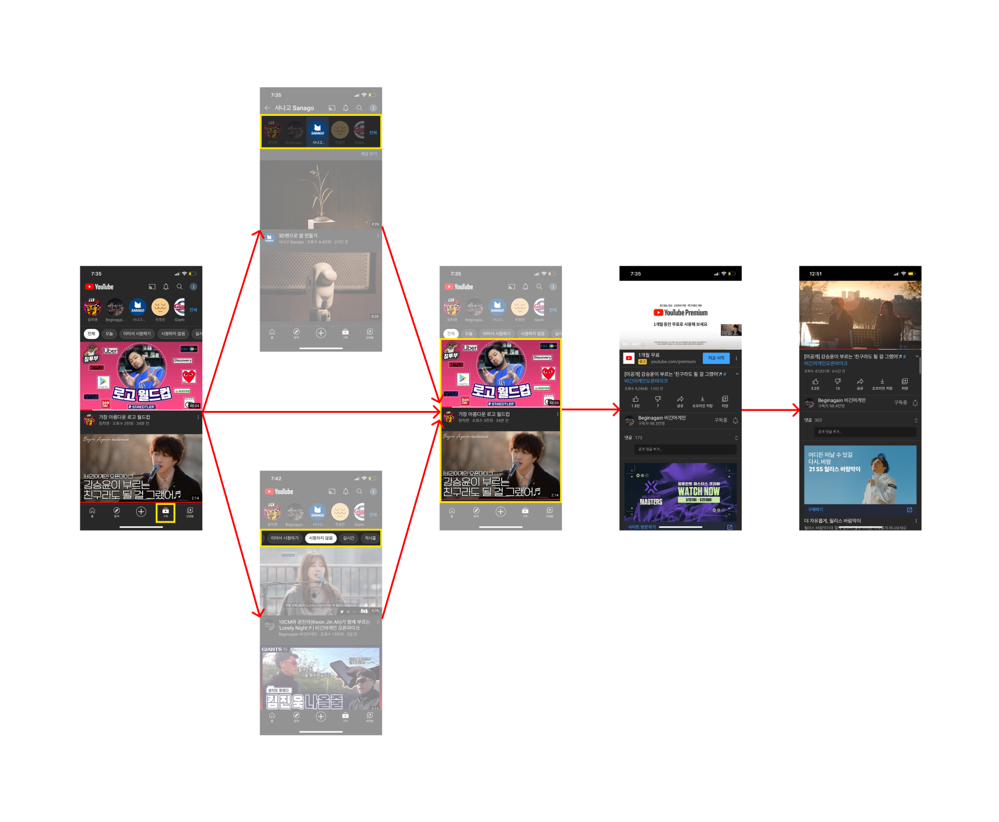

### ► User Action

#### - **'구독' 탭 첫 페이지**

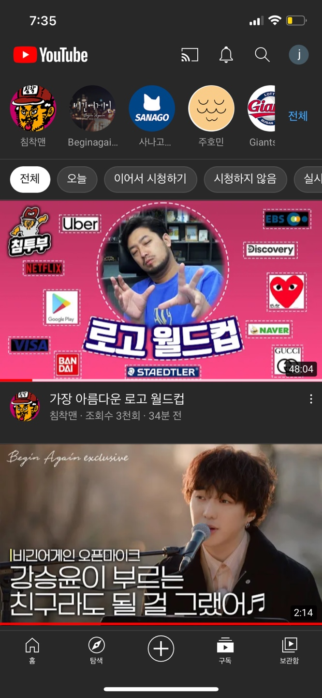

##### ▻ 구성 요소

- 헤더
- **구독 채널 리스트**
- **필터링 태그 리스트**
- **동영상 리스트**
  - ❌ 광고 동영상이 없다 ❌
- 메뉴바

##### ▻ 'User'의 액션

- **필터링** **채널 탐색, 선택**
- **필터링 상황 탐색, 선택**
- **동영상 탐색, 선택**

#### **- 필터링** **채널 탐색, 선택 / 필터링 상황 탐색, 선택**

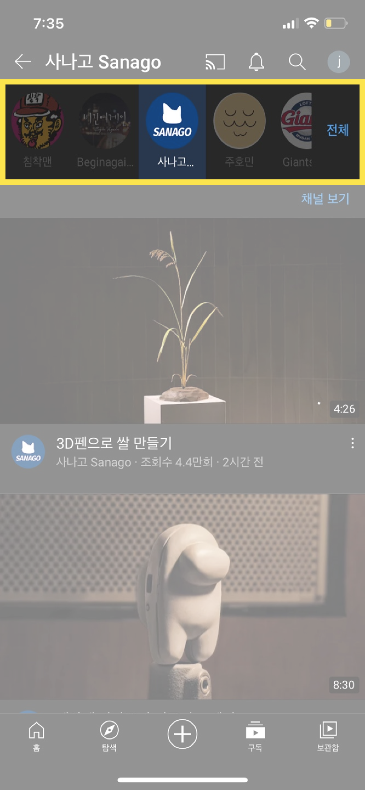

##### ▻ 'User'의 액션

: 가로 스크롤 메뉴 형태의 구독 채널 리스트 또는 필터링 태그 리스트를 탐색하여 그 중 하나를 선택하거나 선택하지 않는다.

#### **- 동영상 탐색**

##### ▻ 'User'의 액션

: 필터링 된 **동**영상 리스트를 탐색하고 그 중 하나를 선택하거나 선택하지 않는다.

##### ▻ '조회수'와 '업로드 후 경과 시간'을 보여주는 이유 💥

- 조회수

: 동영상 소비자가 해당 동영상을 시청하지 않은 상황에서 동영상의 인기를 가늠할 수 있다.

- 업로드 후 경과 시간

: 조회수의 한계를 보완해준다.

ex. 조회수 10만회 ∙ 1시간 전 / 조회수 10만회 ∙ 2년 전

- 조회수에는 동영상을 시청한 소비자들의 동영상에 대한 선호가 반영되지는 않지만 인기를 가늠할 수 있는 유의미한 지표이다.
- 좋아요/싫어요, 댓글, 구독은 동영상과 채널의 전반적인 인기도를 측정할 수 있는 항목이지만 동영상 소비자가 모두 참여하지는 않는다. 하지만 좋아요/싫어요, 댓글, 구독 수는 컴퓨터 프로그램이 아닌 실제 사람의 참여를 집계하고자하여 이를 판별하는 과정을 거쳐 조회수보다 신뢰도가 높다.

#### **- 동영상 선택**

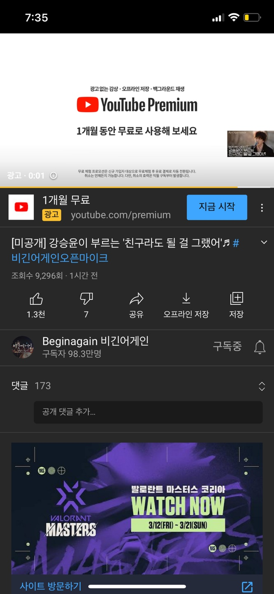
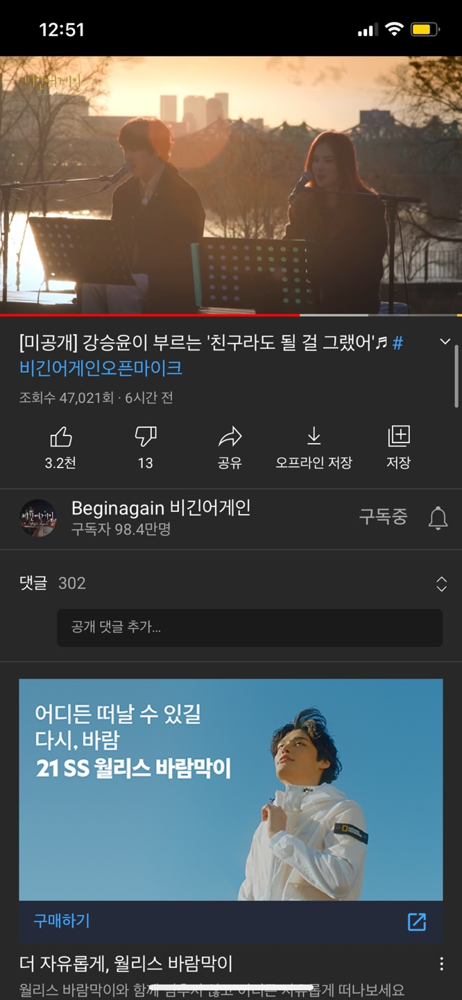

광고 이후 동영상이 재생된다.

#### 혹시 이것도..?

: 동영상 시청 중 다른 동영상을 클릭하면 이전 동영상으로 돌아가는 방법이 없다. 혹시 이것도 의도가 있는걸까?

⇒ 시청하던 동영상을 다시 검색하는 과정에서 다양한 동영상에 노출시키기 위함이다. 라는 추측..

---

---

REF.

[한국인 앱 체류시간 증가율 1위 넷플릭스... 페이스북은 20% 감소](https://www.sedaily.com/NewsVIew/1ZA9I9VMTU)

[[유튜브 경제학] 월 20억명·매일 10억시간 시청... 세상을 바꾼 유튜브](https://www.etoday.co.kr/news/view/1846745)

[[단독]국민 529명당 1명이 유튜버...세계 1위 '유튜브 공화국' - 머니투데이](https://news.mt.co.kr/mtview.php?no=2021021311274021985)

[멍청이를 위한 IT 데이터 #4 - 유저 액션](https://brunch.co.kr/@happy-mil/7)

[What’s YouTube’s Ad Revenue?](https://www.tubics.com/blog/youtube-revenue)

---

#### 추가 소스

- 유튜브 로컬라이제이션
- 북극성 측정법(North Start metric): 제품이 고객에게 제공하는 핵심 가치를 가장 잘 포착하는 '단일 측정 항목'
