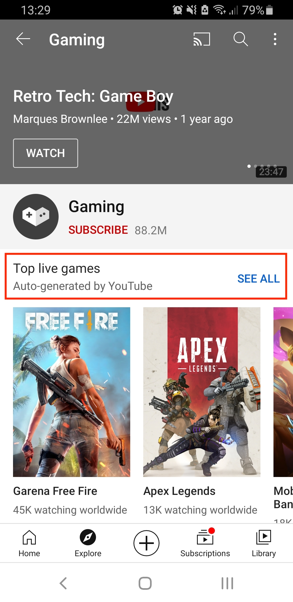
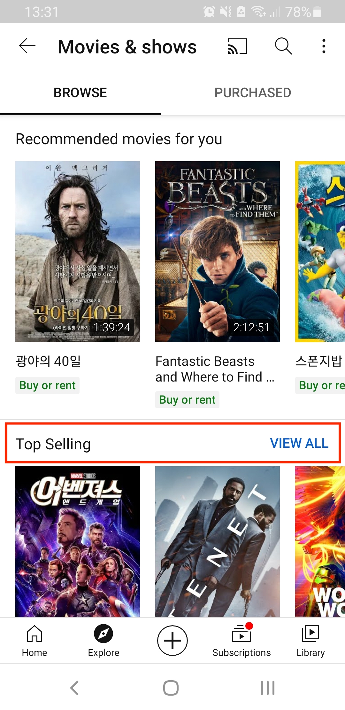
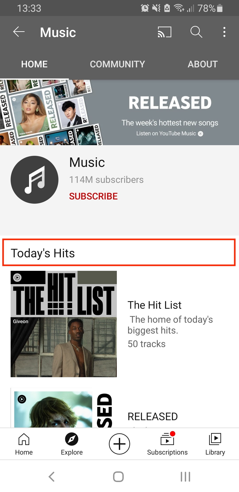
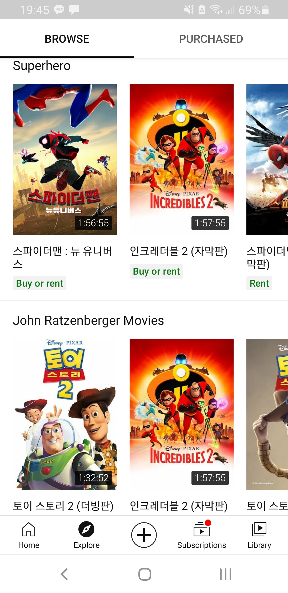

# explore

## 목표

### 새로운 흥미 분야 발견

카테고리로 묶인 선택지를 통해서 관련 카테고리에서 인기있는 영상을 쉽게 찾을 수 있다.

### 인기 급상승 Creator & Artist

컨텐츠의 다양성을 위해 매일 생기는 새로운 크리에이터와 아티스트들이 팬을 찾을 수 있도록 도와주는 기능

24시간동안 지속되며 파란 뱃지로 이를 표시하고 있다.

우리나라에서는 creator on rise만 설정되어 있음

### 인기 급상승 영상 (Trending videos)

Trending은 유튜브와 세계 곳곳에서 일어나는 일들을 보여주는 탭

즉, 유저에게 새로운 흥미거리를 찾을 수 있게 도와주는 탭임

## 서비스에 상주하고 있는 고객층

Youtube는 거의 모든 연령대, 남녀를 불문하고 사용하고 있으므로 연령과 남녀를 떠나 컨텐츠 생산자와 소비자로 크게 구분할 수 있다고 생각하였습니다. 광고주도 고객층 중 하나

유튜브가 모든 연령대를 타겟팅하기 위해서는 생산자가 본인의 target을 잘 설정할 수 있도록 도와주는 것이 더 나음

## 유저가 행동하는 방향 (각 페이지대로 시퀀스)

유저의 새로운 흥미거리를 찾는 과정

### T.O.P

 

커피는 역시 T.O.P

 

메뉴 대부분이 공통적으로 인기 영상 위주로 상단에 'top 무엇'으로 소개를 해놓아서 사람들이 쉽게 영상을 선택해서 볼 수 있게 해줍니다.

 

---

 

Game/Sports/News와 같이 동적인 메뉴의 경우 live 라인이 따로 있어서 현재 상영 중인 영상이 있다면 바로 시청할 수 있도록 도와줍니다.

 

films과 music과 같이 수익 창출이 되는 탭의 경우 끝없이 다른 장르로 추천을 해줌(추천 탭이 정말 많음) 그러므로 셀렉션이 많은 fashion&beauty채널의 경우 광고주들을 위한 것이라고 할 수 있음

 

 

영화를 장르 위주로 추천해주다가 아래로 갈수록 특정 인기 많은 만화 또는 시리즈, 영화 배우 위주로 끝없이 추천을 이어가서 어떻게든 소비자가 마음에 들 수 있는 선택권을 가질 수 있게 노력하는 모습을 볼 수 있음

 

디스플레이도 영화포스터와 비슷하게

 

<!--  -->

 

음악의 경우 장르로 분류할 경우 오히려 선택이 어렵고 담을 수 있는 컨텐츠들도 제한적이므로 기분이나 상황에 따라 분류하여 소비자가 쉽게 새로운 음악도 접할 수 있도록 해놓았고 community라는 탭을 첨부하여 인스타그램처럼 아티스트들이 소통할 수 있는 창구도 마련

 

디스플레이는 음악 CD와 비슷하게 한 것 같음

 

community탭의 경우 아티스트들 즉, 컨텐츠 생산자이면서 동시에 광고주일수도 있는 사람을 대상으로 하는 서비스 같은 개념이 아닐까?

 

 

 

# explore의 시퀀스 배치

상단 - 유저에게 원하는 주제를 선택할 수 있게 함.
explore의 메인 페이지에 이미 trending videos가 떠있음에도 불구하고 Trendingd이라는 선택권을 제일 먼저 배치함 -> 목적없이 그냥 새로운 것을 찾고 싶어하는 사람들을 위한 탭일까?

대부분의 메뉴에서는 제일 먼저 현재 가장 인기있는 컨텐츠들이 배치되어 있음

가로로 봤을 때 더 편하게 디자인되어 있다고 느낌

# revenue coming from where?

ads contribute roughly 10 percent to all Google revenue.

Youtube TV, Music, premium -> subscription business
https://www.tubics.com/blog/youtube-revenue/

## Youtube premium

- Ad-free
- download videos
- play in the background

## Youtube Music

- Ad-free
- download music
- play in the background

## Youtube Originals

- have access to all the Originals available

## Youtube Kids

## Youtube Gaming

뭐 특별한게 있는 건 아니고 광고없고 다운로드가능하고 백그라운드에서 상영되는건 똑같은데 유튭에서 생산되는 게임 관련 영상들을 볼 수 있는거라네
https://fourweekmba.com/how-does-youtube-make-money/#:~:text=YouTube%20Make%20Money%3F-,YouTube%20Business%20Model%20In%20A%20Nutshell,B%20in%20revenues%20in%202019.
